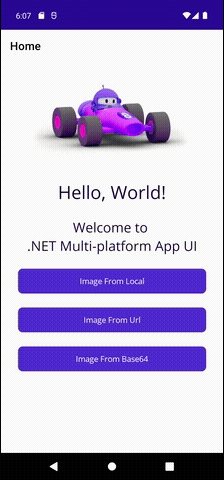

# Plugin.Toolkit.Image


[](https://www.nuget.org/packages/Plugin.Toolkit.Image) 
[](https://dotnet.microsoft.com/en-us/apps/maui)
[](https://opensource.org/licenses/MIT)

[](https://www.android.com/)
[-red)](https://www.apple.com/ios/)

`Plugin.Toolkit.Image` is a .NET MAUI library that provides an enhanced image viewing experience by leveraging native platform capabilities. This approach ensures optimal performance and a seamless user experience. Currently, the library supports Android and features pinch-to-zoom functionality. Future updates will include support for iOS and additional image manipulation features.

## Features

*   **Native Performance:** Utilizes native platform components for optimal performance and smooth interactions.
* **Flexible Caching**: Configurable caching options to enhance app performance.
*   **Pinch-to-Zoom:** Allows users to zoom in and out of images using the familiar pinch gesture.
*   **Cross-Platform (Future):** Designed to be cross-platform, with upcoming support for iOS.
*   **Extensible:** Built with extensibility in mind, making it easy to add new features and customizations.
* **Demo Project**: Includes a demo project to get you started





### Prerequisites

*   .NET SDK 8.0 or later

## Installation

You can install the plugin via NuGet:

```bash
Install-Package Plugin.Toolkit.Image
```

## Usage

   **Register:**

    In your `MauiProgram.cs` file:

   ```csharp
    using Plugin.Toolkit.Image; // <-- add this

    public static class MauiProgram
    {
        public static MauiApp CreateMauiApp()
        {
            var builder = MauiApp.CreateBuilder();
            builder
                .UseMauiApp<App>()
                .UseImageToolkit() // <-- add this
                .ConfigureFonts(fonts =>
                {
	            fonts.AddFont("OpenSans-Regular.ttf", "OpenSansRegular");
	            fonts.AddFont("OpenSans-Semibold.ttf", "OpenSansSemibold");
                });

            return builder.Build();
        }
    }
   ```

   **Using Local Image:**
   ```csharp
    string imagePath = "dotnet_bot.png";
    ImageToolkit.FromLocal(imagePath);
   ```

   **Using Url:**
   ```csharp
    string imagePath = "https://example.com/image";
    ImageToolkit.FromUrl(imagePath, ImageToolkit.CacheType.Disk);
   ```

   **Using Base64:**
   ```csharp
    string base64 = "data:image/png;base64,iVBORw0KGgoAAAANSU....";
    ImageToolkit.FromBase64(base64);
   ```

## Example Project
The repository includes a sample MAUI project demonstrating the usage of the plugin. You can find it in the `samples` directory.

## Contributing
Contributions are welcome! Please open an issue or submit a pull request.

## Contact
If you have any questions or suggestions, please feel free to contact me at andyapin@gmail.com
